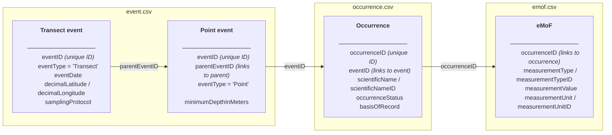

# obis-example

Materials for the OBIS June 2026 workshop. This repository demonstrates how to
convert field monitoring data from the Tampa Bay Interagency Seagrass Monitoring
Program into Darwin Core Archive format for submission to the Ocean Biodiversity
Information System (OBIS).

## Background

The [Tampa Bay Interagency Seagrass Monitoring Program](https://tampabay.wateratlas.usf.edu/seagrass-monitoring/)
has tracked seagrass distribution and condition across Tampa Bay since 1998. Field
crews survey fixed transects throughout the bay each year, recording species cover
using the Braun-Blanquet scale along with blade length, shoot density, and
sediment type at regularly spaced meter marks. The program is coordinated by the
Tampa Bay Estuary Program (TBEP) and involves multiple partner agencies.

Data are managed through the [tbeptools](https://tbep-tech.github.io/tbeptools/)
R package, which provides standardized access to the transect monitoring records
and spatial reference layers.

## What is OBIS?

[OBIS](https://obis.org) (Ocean Biodiversity Information System) is a global
open-access database for marine species occurrence data. Publishing data to OBIS
requires formatting records in [Darwin Core](https://dwc.tdwg.org/) — a
standardized vocabulary for biodiversity data — structured as a Darwin Core
Archive (DwC-A).

## Repository contents

```
R/
  convert_to_dwc.R   Convert seagrass transect data to Darwin Core Archive
  obis_api.R         R client for querying the OBIS API (retrieval only)
  examples.R         Example queries using obis_api.R
data/
  trnsct.csv         Seagrass transect monitoring records exported from tbeptools
dwc/
  event.csv          Darwin Core Event core
  occurrence.csv     Darwin Core Occurrence core
  emof.csv           Extended Measurement or Fact (eMoF) extension
```

## Requirements

R packages (install once):

```r
install.packages(c("dplyr", "tidyr", "readr", "lubridate", "sf", "worrms",
                   "tbeptools", "here", "obistools"))
```

For OBIS API queries only:

```r
install.packages(c("httr2", "jsonlite"))
```

## Running the conversion

1. Open `R/convert_to_dwc.R` and review the configuration block at the top.
   Set `INSTITUTION_CODE`, `DATASET_NAME`, and `LICENSE` as appropriate.
2. Source the script. It will:
   - Load transect records from `data/trnsct.csv` and spatial reference points
     from the `tbeptools` `trnpts` object
   - Resolve all taxa to accepted WoRMS names via the `worrms` package
   - Write three CSV files to `dwc/`
3. After the run, inspect `species_lookup` in your R session to confirm all
   WoRMS matches are correct. Known ambiguous genera (where WoRMS returns
   multiple accepted records) are pinned to specific AphiaIDs via the
   `aphia_overrides` vector near the top of section 2. Add entries there
   for any additional ambiguous names you encounter.

## Darwin Core Archive structure

The three output files are linked by shared identifiers:

## Darwin Core Archive structure

The three output files are linked by shared identifiers:



Each transect visit produces one parent event row. Each meter mark observation
along that transect produces one child event row linked back to the parent.
Occurrence rows (one per species observed, plus one absence record per bare
point) link to the child event. Quantitative measurements (cover code, blade
length, shoot density, epiphyte density, sediment type) attach to each
occurrence row in the eMoF file.

## Before submitting to OBIS

- [ ] Confirm all WoRMS matches in `species_lookup` are correct
- [ ] Confirm remaining NERC P01 `measurementTypeID` codes in `emof.csv` —
      blade length (`OBSINDLX`) and shoot density (`SDBIOL02`) are resolved;
      Braun-Blanquet cover, epiphyte density, and sediment type still need
      codes (request via [github.com/nvs-vocabs/OBISVocabs](https://github.com/nvs-vocabs/OBISVocabs/issues))
- [ ] Register the dataset at [obis.org](https://obis.org) to obtain a
      `datasetID` UUID, then update `DATASET_ID` in the configuration block
- [ ] Author EML metadata (required alongside the CSVs — see the
      [OBIS metadata guide](https://manual.obis.org/eml.html))
- [ ] Validate the archive using the
      [OBIS validator](https://obis.org/manual/processing/) before upload

## References

- OBIS manual: https://manual.obis.org/
- Darwin Core terms: https://dwc.tdwg.org/terms/
- WoRMS (World Register of Marine Species): https://www.marinespecies.org/
- tbeptools documentation: https://tbep-tech.github.io/tbeptools/
- Tampa Bay seagrass monitoring: https://tbep.org/seagrass-monitoring/